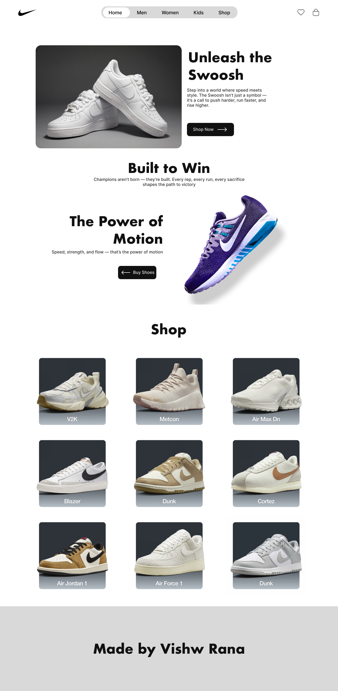

# Nike Clone Website 👟

A **Nike Landing Page Clone** built with **HTML and CSS**, designed in **Figma** and developed to be **fully responsive** across devices.  

🔗 **Live Demo**: [nike-clone-vishw.netlify.app](https://nike-clone-vishw.netlify.app/)

---

## 🚀 Features
- 🎨 **Pixel-perfect design** exported from Figma  
- 💻 **Responsive layout** (works on desktop, tablet, and mobile)  
- 📦 Built only with **HTML + CSS** (no frameworks)  
- ⚡ Lightweight and fast loading  
- 🛍️ Sections include:
  - Hero Section with CTA
  - "Built to Win" Promo
  - "Power of Motion" Promo
  - Shop Grid
  - Footer with credits  

---

## 🛠️ Tech Stack
- **HTML5**
- **CSS3** (Flexbox & Grid for responsiveness)
- **Figma** (UI/UX Design)  

---

## 🖼️ Screenshot

